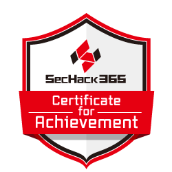

### Profile🧾
- Name: Nanami Takemoto
- Job: Infrastructure Engineer
- Language: Japanese(native), English(just a little)

### GitHub activities🐙

### Blog activities✒️

### Other activities

### Links🔗
- LinkdIn: https://www.linkedin.com/in/nanami-takemoto-761690283/
- X: https://x.com/Nanami_Takemoto
- Blog: https://nanami-takemoto.com
- Qiita: https://qiita.com/ija
- Publication: https://techbookfest.org/organization/3mNCv38NVSj5h8e8XM1ns9

<!---
nanami-takemoto/nanami-takemoto is a ✨ special ✨ repository because its `README.md` (this file) appears on your GitHub profile.
You can click the Preview link to take a look at your changes.
--->
