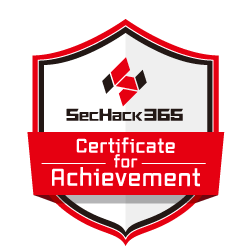

### Profile🧾
- Name: Nanami Takemoto
- Job: DevOps Engineer
- Language: Japanese(native), English(just a little)

### Blog activities✒️

### GitHub activities🐙

### Other activities

### Links🔗
- LinkdIn: https://www.linkedin.com/in/nanami-takemoto-761690283/
- X: https://x.com/Nanami_Takemoto
- Blog: https://nanami-takemoto.com
- Qiita: https://qiita.com/ija
- Slideshare：　https://www.slideshare.net/NanamiTakemoto
- Publication: https://techbookfest.org/organization/3mNCv38NVSj5h8e8XM1ns9

